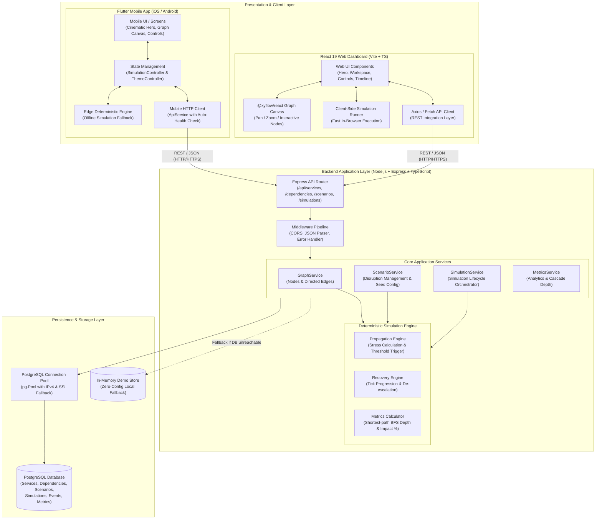

# 01 — High-Level System Architecture

The **Urban Infrastructure Cascade Simulator** implements a high-resilience, multi-tier architecture enabling interactive modeling of municipal network failures and recovery cascades.

---

## Architectural Highlights
1. **Multi-Platform Consistency**: Mobile (Flutter) and Web (React 19) consume the exact same REST API format and share the same design language and color tokens.
2. **Dual-Tier Simulation Engine**: The deterministic cascade algorithm runs identically in the backend cloud service (TypeScript) or locally on the mobile/web client (Dart/TypeScript) for offline resilience.
3. **Graceful Fallback Strategy**:
   - Backend auto-detects PostgreSQL connectivity. If unreachable, it falls back to an in-memory repository without breaking API calls.
   - Mobile and Web clients auto-detect backend availability. If offline, they switch seamlessly to local deterministic simulation.
