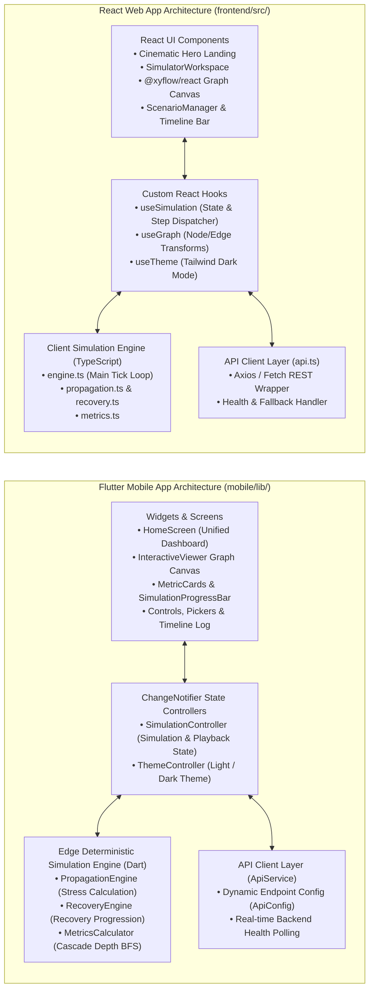

# 02 — Mobile & Web Client Architecture

The client presentation layer provides responsive, accessible, and high-performance interactive interfaces for inspecting and executing urban cascade simulations.

---

## Component Responsibilities

### 1. Flutter Mobile Application (`mobile/lib/`)
- **`config/app_theme.dart`**: Unified design system tokens, Navy/Canvas palette, custom status colors (`#2E8B57` Success, `#C94B4B` Critical, `#D49A2A` Warning).
- **`widgets/graph/graph_canvas.dart`**: Custom-rendered touch canvas with `InteractiveViewer`, animated pulse curves, and bottom sheet service inspection.
- **`providers/simulation_controller.dart`**: Central orchestrator managing tick playback (Play, Pause, Step, Reset), scenario selection, and local/remote engine switching.
- **`services/api_service.dart`**: Robust HTTP client featuring connection auto-probing and graceful fallback to local seed data.

### 2. React Web Dashboard (`frontend/src/`)
- **`components/cinematic/`**: Scroll-driven storytelling hero introducing smart city infrastructure dependencies.
- **`components/graph/`**: Flow graph powered by `@xyflow/react` with custom status nodes and directional edges.
- **`components/simulation/`**: Controls for injecting disruptions, initiating recovery actions, and managing saved scenarios.
- **`components/timeline/`**: Horizontal timeline tracking state transition events by simulation second (\(T+Xs\)).
