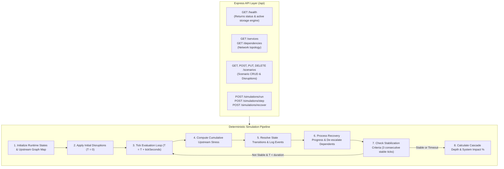

# 03 — Backend API & Simulation Engine Pipeline

The backend server is built with Node.js, Express, and TypeScript, structured cleanly into controllers, routes, application services, and the deterministic simulation engine.

---

## Backend Subsystems

### 1. Routes & Controllers (`backend/src/routes/`)
- `/api/health`: Probes database connection status and returns active storage engine (`postgresql` or `memory`).
- `/api/services`: Lists all registered infrastructure service nodes and individual service details.
- `/api/dependencies`: Lists all directed inter-service dependency relationships.
- `/api/scenarios`: Full CRUD API for predefined and user-created disaster scenarios.
- `/api/simulations`: Triggers synchronous simulations, multi-tick progression, and recovery operations.

### 2. Core Services (`backend/src/services/`)
- **`GraphService`**: Manages infrastructure topology, node validation, and upstream/downstream maps.
- **`ScenarioService`**: Validates disruption configurations, seed parameters, and duration limits.
- **`SimulationService`**: Coordinates simulation runs, generates time-series snapshots, and commits results to PostgreSQL.
- **`MetricsService`**: Analyzes cascade metrics, system impact percentages, and recovery durations.

### 3. Simulation Engine (`backend/src/simulation/`)
- **`engine.ts`**: Main deterministic execution loop iterating until stabilization or time expiration.
- **`propagation.ts`**: Calculates upstream stress contributions and triggers state degradations/failures.
- **`recovery.ts`**: Decrements recovery tick timers, handles `RECOVERING` $\to$ `RECOVERED` $\to$ `HEALTHY` transitions, and de-escalates downstream stress.
- **`metrics.ts`**: Computes cascade propagation depth using Breadth-First Search (BFS) and tracks critical service impact.
