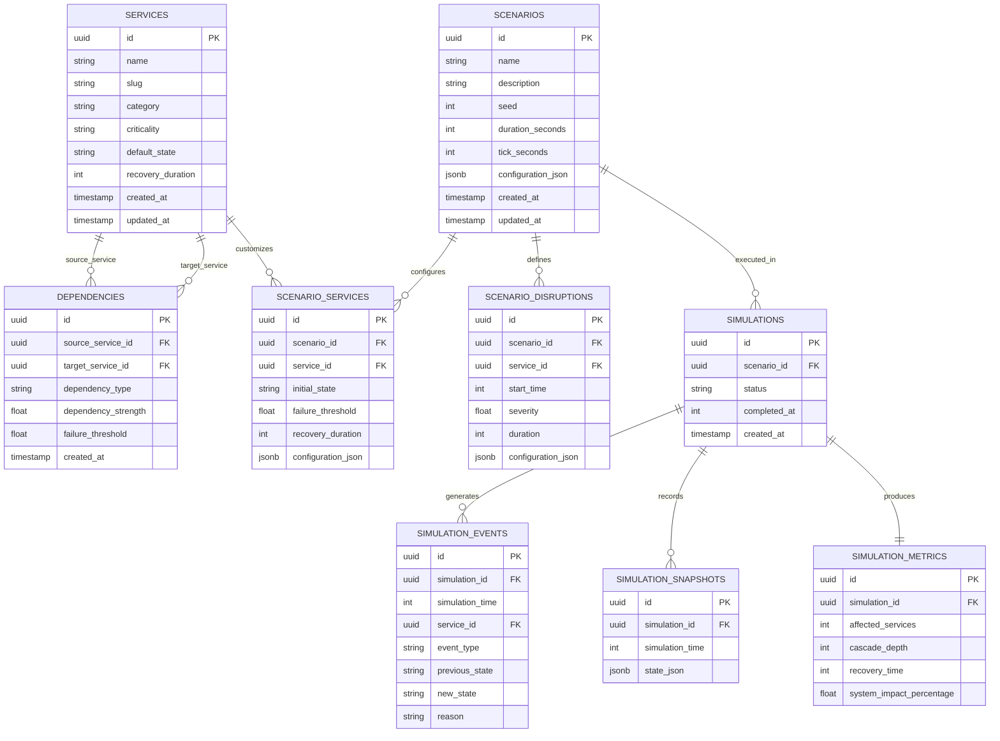

# 05 — Database Entity-Relationship Model (ERD)

The database persistence layer is implemented in PostgreSQL and structured to enforce referential integrity across infrastructure topologies, scenario definitions, simulation execution runs, granular state snapshots, and cascade metrics.

---

## Key Schema Design Decisions

1. **Self-Referencing Dependencies (`dependencies`)**: Models directed graph edges with `source_service_id` and `target_service_id` referencing `services(id)`.
2. **Deterministic Seed Storage (`scenarios.seed`)**: Stores integer seed values ensuring that stochastic disruptions or simulated jitter remain 100% reproducible.
3. **JSONB Snapshot Serialization (`simulation_snapshots.state_json`)**: Stores full system state at each tick (\(T=0, 1, 2 \dots N\)) for time-scrubbing playback.
4. **Normalized Event Stream (`simulation_events`)**: Enables granular audit logs of every individual state change with simulation timestamp and transition cause.
