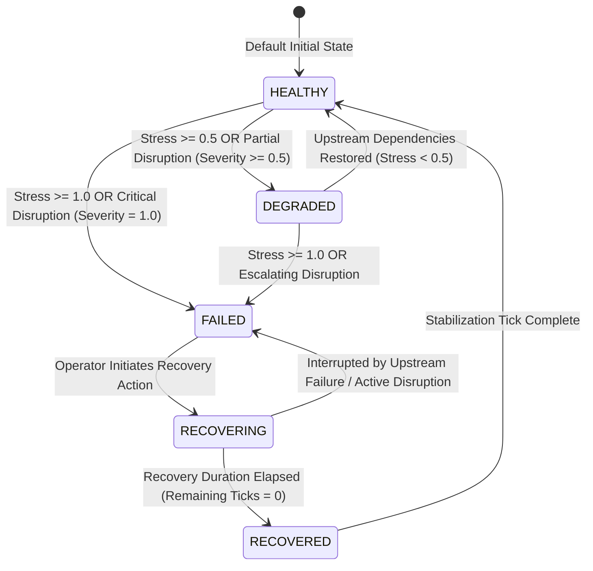

# 06 — Service State Machine & Lifecycle Transitions

Every infrastructure service node in the simulator exists in one of five distinct states: `HEALTHY`, `DEGRADED`, `FAILED`, `RECOVERING`, or `RECOVERED`.

---

## State Definitions

| State | Status Color | Visual Cue | Operational Meaning |
| :--- | :--- | :--- | :--- |
| **`HEALTHY`** | Emerald (`#2E8B57`) | Solid green outline | Service operates at full capacity; imposes zero stress on dependents. |
| **`DEGRADED`** | Amber (`#D49A2A`) | Pulsing warning amber | Partial operation or reduced capacity; contributes \(0.5 \times \text{weight}\) downstream stress. |
| **`FAILED`** | Crimson (`#C94B4B`) | Glowing red border | Complete operational blackout; contributes \(1.0 \times \text{weight}\) downstream stress. |
| **`RECOVERING`** | Blue / Cyan (`#3B82F6`) | Progress spinner | Active repair crews/protocols engaged; countdown timer active; contributes \(0.25 \times \text{weight}\) downstream stress. |
| **`RECOVERED`** | Teal (`#14B8A6`) | Quick transient check | Service has finished physical repairs; validating network synchronization before marking `HEALTHY`. |

---

## Recovery Lifecycle & De-escalation

1. **Recovery Initiation**: An operator triggers recovery for a failed node (e.g. Power Grid).
2. **Tick Countdown**: `recoveryTicksRemaining` decrements each tick (e.g., from \(3 \to 2 \to 1 \to 0\)).
3. **Downstream Cascade De-escalation**: As the power grid reaches `RECOVERING` and `RECOVERED`, downstream stress on dependent nodes (Hospital, Water Supply) drops from \(1.0 \to 0.25 \to 0.0\).
4. **Autonomous Dependent Healing**: Once downstream stress drops below \(0.5\), dependent services automatically transition from `DEGRADED` back to `HEALTHY`.
