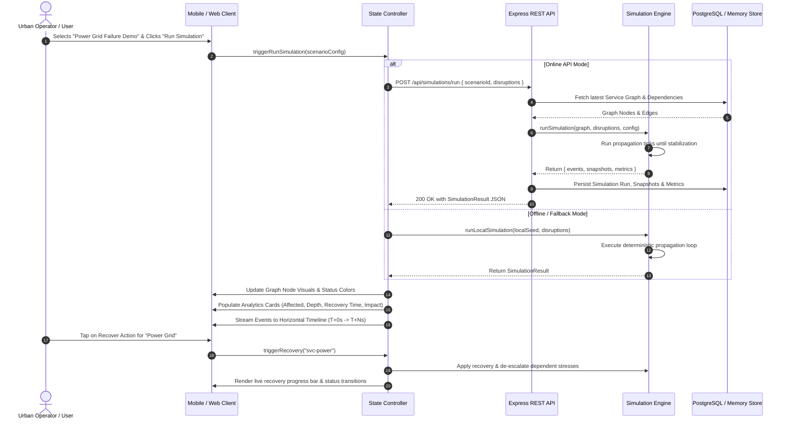

# 07 — End-to-End Simulation Execution Sequence

This sequence diagram illustrates the complete interactive workflow when a user selects a disruption scenario, triggers the simulation, reviews cascade metrics, and performs targeted recovery actions.

---

## Execution Stages Detailed

1. **Disruption Injection (\(T=0\))**:
   - Initial root disruptions are applied (e.g. `svc-power` receives Severity \(1.0 \implies \text{FAILED}\)).
2. **Cascade Propagation (\(T=1 \dots K\))**:
   - Each tick evaluates upstream stress on all connected services.
   - Hospital, Water Supply, Transport, and Telecommunications degrade and fail in cascade order.
3. **Stabilization Check (\(T=K+1 \dots K+3\))**:
   - Engine counts consecutive ticks with zero state transitions. Upon 3 unchanged ticks, emits `STABILIZED` event and stops.
4. **Analytics Extraction**:
   - Calculates shortest-path cascade depth via BFS.
   - Computes total affected count and percentage of municipal infrastructure impacted.
5. **Interactive Recovery**:
   - Operator initiates recovery. The engine decrements remaining repair ticks and gradually eases stress on downstream services until normal operation is restored.
