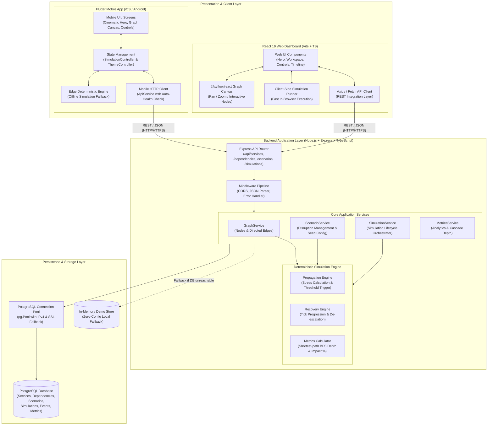
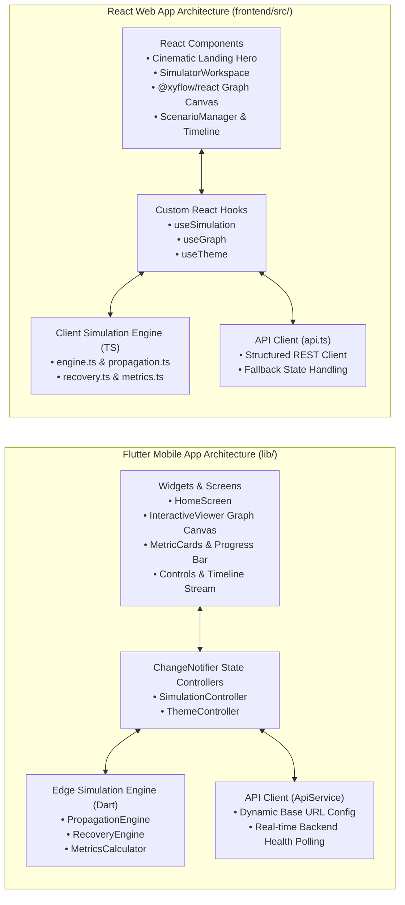
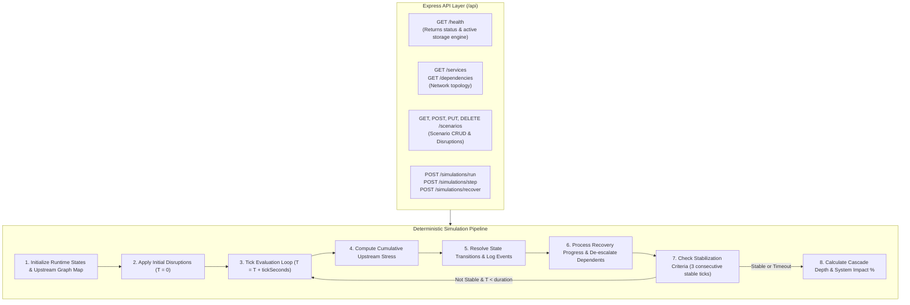
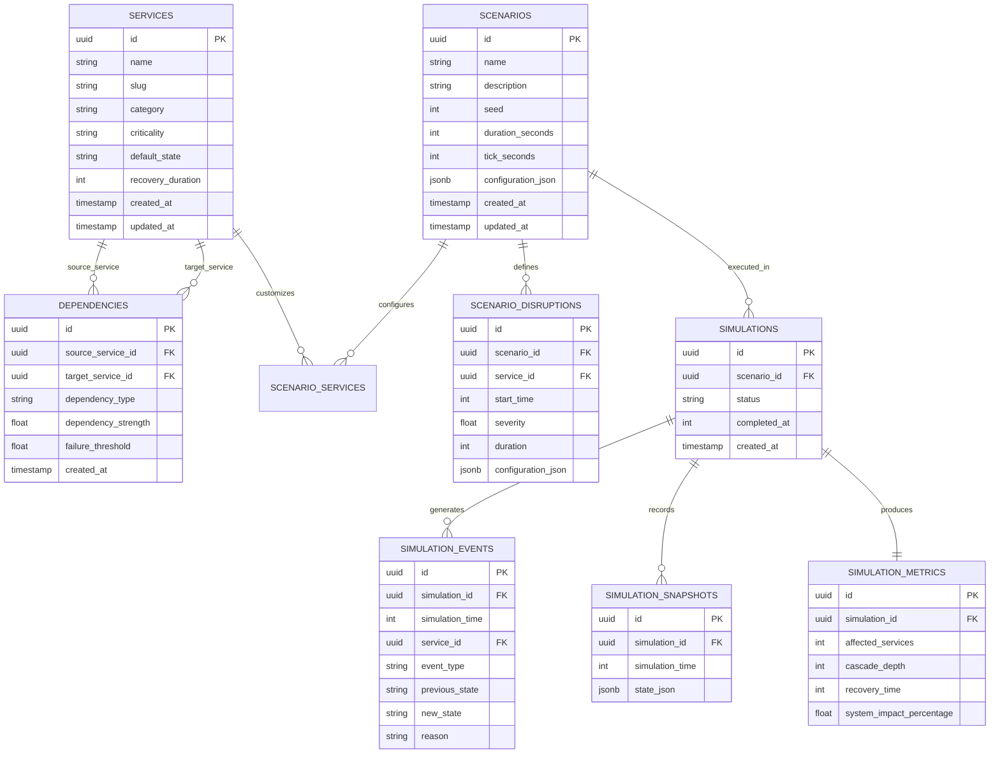
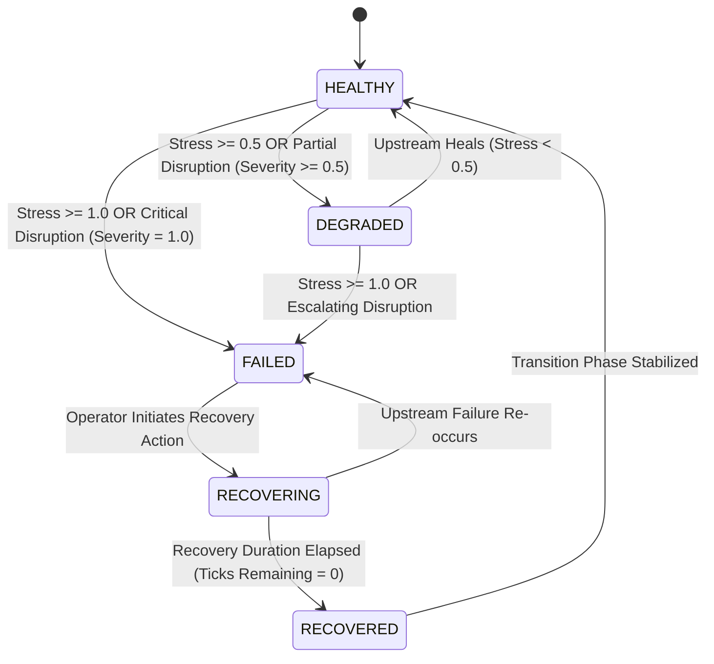
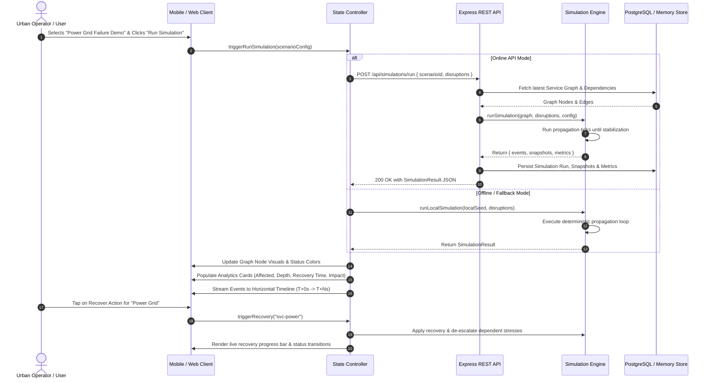

# Urban Infrastructure Cascade Simulator — Complete System Design & Architecture

This document provides the authoritative technical specification and architectural blueprint for the **Urban Infrastructure Cascade Simulator**. It details the multi-tier topology, mobile and web presentation layers, deterministic simulation engine, backend REST API, database schema, mathematical models, and lifecycle sequence flows.

---

## Table of Contents
1. [High-Level System Architecture](#1-high-level-system-architecture)
2. [Presentation Layer (Mobile & Web)](#2-presentation-layer-mobile--web)
3. [Backend API & Simulation Engine Pipeline](#3-backend-api--simulation-engine-pipeline)
4. [Mathematical Model & Cascade Propagation Formulas](#4-mathematical-model--cascade-propagation-formulas)
5. [Database Entity-Relationship Model (ERD)](#5-database-entity-relationship-model-erd)
6. [Service State Machine & Lifecycle Transitions](#6-service-state-machine--lifecycle-transitions)
7. [End-to-End Simulation Execution Sequence](#7-end-to-end-simulation-execution-sequence)
8. [Cross-Cutting Architectural Principles](#8-cross-cutting-architectural-principles)

---

## 1. High-Level System Architecture

The simulator uses a three-tier architecture with multi-platform client support (Flutter Mobile + React Web), a high-performance Express REST API, a dual-mode deterministic simulation engine (capable of running in the cloud or directly on edge devices with zero latency offline fallback), and a persistent PostgreSQL database backed by an in-memory fallback store.

---

## 2. Presentation Layer (Mobile & Web)

The user interfaces on both Mobile and Web share the same strict design tokens, color palette, dark/light themes, and interactive capabilities while being optimized for their respective interaction patterns.

### Client Subsystem Comparison

---

## 3. Backend API & Simulation Engine Pipeline

The Express backend provides clean REST endpoints with centralized error handling, request validation, deterministic execution, and database persistence.

---

## 4. Mathematical Model & Cascade Propagation Formulas

The urban service infrastructure is represented as a directed graph:
\[
G = (V, E)
\]
Where:
- \( V \) = Set of municipal infrastructure services (Power Grid, Hospital, Water Supply, Transport, Telecommunications, Emergency, Residential, Commercial).
- \( E \) = Set of directed dependency edges \( (u, v) \in E \), indicating that service \( v \) depends on upstream service \( u \).
- \( w_{u \to v} \in (0, 1] \) = Weight / strength of the dependency.

### 4.1 Upstream Stress Function
For any service \( v \in V \) at simulation tick \( t \), incoming upstream stress is defined as:
\[
\text{Stress}(v, t) = \sum_{u \in \text{Upstream}(v)} w_{u \to v} \cdot C(\text{State}(u, t))
\]

Where the state stress contribution factor \( C(\text{State}) \) is:
\[
C(\text{State}) = \begin{cases} 
1.0 & \text{if } \text{State} = \text{FAILED} \\
0.5 & \text{if } \text{State} = \text{DEGRADED} \\
0.25 & \text{if } \text{State} = \text{RECOVERING} \\
0.0 & \text{if } \text{State} \in \{\text{HEALTHY}, \text{RECOVERED}\}
\end{cases}
\]

### 4.2 State Evaluation Thresholds
- **DEGRADED Threshold:** \(\text{Stress}(v, t) \ge 0.5 \implies \text{State}(v, t) = \text{DEGRADED}\)
- **FAILED Threshold:** \(\text{Stress}(v, t) \ge 1.0 \implies \text{State}(v, t) = \text{FAILED}\)

### 4.3 Cascade Depth & Metrics Calculation
- **Cascade Depth:** The maximum shortest-path distance in the dependency DAG from any initial disruption root \( r \in R \) to any affected node \( a \in A \):
\[
\text{Depth} = \max_{a \in A} \left( \min_{r \in R} \text{dist}(r, a) \right)
\]
- **System Impact Percentage:**
\[
\text{Impact } \% = \left( \frac{|A|}{|V|} \right) \times 100
\]

---

## 5. Database Entity-Relationship Model (ERD)

---

## 6. Service State Machine & Lifecycle Transitions

Each infrastructure node transitions through discrete states based on external disruptions, incoming dependency stress, and active recovery interventions.

---

## 7. End-to-End Simulation Execution Sequence

---

## 8. Cross-Cutting Architectural Principles

1. **Deterministic Reproducibility:** Every scenario uses a seed value and deterministic evaluation loop ensuring identical outcomes across mobile, web, and backend runtimes.
2. **Zero-Lag Offline Resilience:** When network connectivity is absent or PostgreSQL is offline, clients seamlessly fall back to local seed data and client-side simulation.
3. **Layered Separation of Concerns:** UI widgets are strictly decoupled from propagation algorithms and HTTP clients via `ChangeNotifier` state controllers.
4. **Bi-directional Cascade Modeling:** Models both downstream cascading failure and upstream recovery cascade de-escalation.
